# MoooseFreeのビルドガイド
## 目次

- [目次](#目次)
- [頒布時の状態](#頒布時の状態)
- [キット構成](#キット構成)
  - [ご自身で購入いただくもの(リンクは例です。)](#ご自身で購入いただくものリンクは例です)
  - [キット内容一覧](#キット内容一覧)
  - [ケース(キットに含まれます)](#ケースキットに含まれます)
  - [基板(キットに含まれます)](#基板キットに含まれます)
  - [バッテリーサイズの参考](#バッテリーサイズの参考)
- [はんだ付け](#はんだ付け)
  - [マイコン(Xiao)はんだ付けの下準備](#マイコンxiaoはんだ付けの下準備)
  - [バッテリ端子](#バッテリ端子)
  - [ダイオード、MX互換キースイッチソケット](#ダイオードmx互換キースイッチソケット)
  - [4方向+プッシュスイッチ](#4方向プッシュスイッチ)
  - [リセットスイッチ](#リセットスイッチ)
  - [タクトスイッチ](#タクトスイッチ)
  - [ロータリーエンコーダ(任意)](#ロータリーエンコーダ任意)
  - [電源スイッチ](#電源スイッチ)
  - [はんだ付け後](#はんだ付け後)

## 頒布時の状態  
ケースが組み立てられた状態になっています。  
また後半の組み立ての章をざっとご覧いただき、ねじを外していってください。  
一度分解すると構造がよくわかるとおもいます。  

## キット構成
### ご自身で購入いただくもの(リンクは例です。)
| ご自身で手配いただくもの    | 個数            | 例(参考リンク) |
| :-------------------------- | :-------------- | :-------------- |
| 表面実装ダイオード(1N4148W) | 112個             | https://shop.yushakobo.jp/products/a0800di-02-100?variant=37665574420641 |
| タクトスイッチ (6x6x5mm 2pin)| 18個             | https://shop.yushakobo.jp/products/a0800ts-02-1 |
| ホットスワップ (MX用orロープロファイル)|最大58個| https://shop.yushakobo.jp/products/a01ps?variant=37665172521121 |
| キースイッチ (MX互換orロープロファイル)|最大58個| ChockV1,V2に対応したフットプリントですが、当面ケースはMX互換向け |
| ロータリーエンコーダ (軸形状:Dカット、おすすめ高さ17.5mm)| 任意(おすすめ2個) | https://shop.yushakobo.jp/products/3762?variant=46240750436583 |
| リチウムイオンバッテリ (※無線にする際の構成例) 45mm(横) x 28mm(縦) x 6mm(厚さ)より一回り小さいもの| 2個(左右1個ずつ)            | ・EEMBリチウムポリマー電池 3.7V 500 mAh https://www.amazon.co.jp/dp/B09DPPMX14?ref_=ppx_hzsearch_conn_dt_b_fed_asin_title_1  ・EEMB リチウムポリマーバッテリー 3.7V 250mAh https://www.amazon.co.jp/dp/B08FD3V6TF?psc=1&smid=A6AC39XNLAVZ4&ref_=chk_typ_imgToDp |

※小さい部品などは少し多めに調達しておくと良いです。  
  ミスしたときに再度買うとなると送料もかかってしまうので。
※本キットは無線使用に限定するものではありません。  
また、バッテリーも例でありこれに限定するものではありません。  

### キット内容一覧
Mustで含まれるものと、オプションで選択可能なものがあります。  

#### キットに含まれるもの
| キットに含まれるもの         |  個数           |
| :--------------------------  | :-------------- |
| ケース一式(トラボ支持球含む) |  1セット |
| 基板                         |  1セット |
| 光学センサと周辺部品 (右基板にはんだ付け済みです。) | 1セット |
| シリコンチップ               |  2個 |
| バッテリー端子               |  2個 |
| 電源スイッチ(トグルスイッチ) |  2個 |
| ネジ(M2x4mm) ケース用(組付け済)        | 10個 |
| ネジ(M2x4mm) トラボ筐体用(組付け済)    |  3個 |
| ネジ(M2x8mm) トラボカバー用(小物袋に入れます)  |  1個 |
| 基板側面につけるチューブ               | カットして使用 |
| カプトンテープ               | カットして使用 |
| エンコーダのノブ             | 大1個,小1個    |
| 4方向+プッシュSW             | 2個    |
| 4方向+プッシュSWのノブ       | 2個    |

#### オプション
Booth購入画面のオプションでキットに含むか選択ください。  
※55mmトラックボール x 1 (有り版/無し版あり。)  
※Xiao ble nRF52840 x 2  (当面は付けます)  

### ケース(キットに含まれます)  
色は黒と白を考えています。  
  1.ケース上(左右)
  2.ケース下(左右)
  3.ミドルプレート(左右)
  4.トラボ筐体(※トラボ支持球3つもキットに同梱されます)  
  5.トラボカバー

トラボカバーは回転でロックが可能な機構にしていますが、初めのうちは固い場合があります。  
バッテリーカバーの部分を力強く押すと割れてしまう場合があるので、必ず根元をもって回転させてください。  

また、トラボ筐体も上からの力に弱い部分があります。  
上から強い力をかけないようにしてください。  
ケースメイン部にねじ止めした状態で扱うことを推奨します。  

### 基板(キットに含まれます)

### バッテリーサイズの参考
リポバッテリーを使用する際は以下のサイズが例になります。  
ケース内にバッテリを収納するため、このサイズよりも一回りちいさいものがよいでしょう。  
高さは6mm以下のものを選びましょう。45mm x 28mmぐらいの面積のものなら入るかと思います。  
消費電力も小さいため、まずは小さいバッテリーで試すでも全然ありだと思います。  

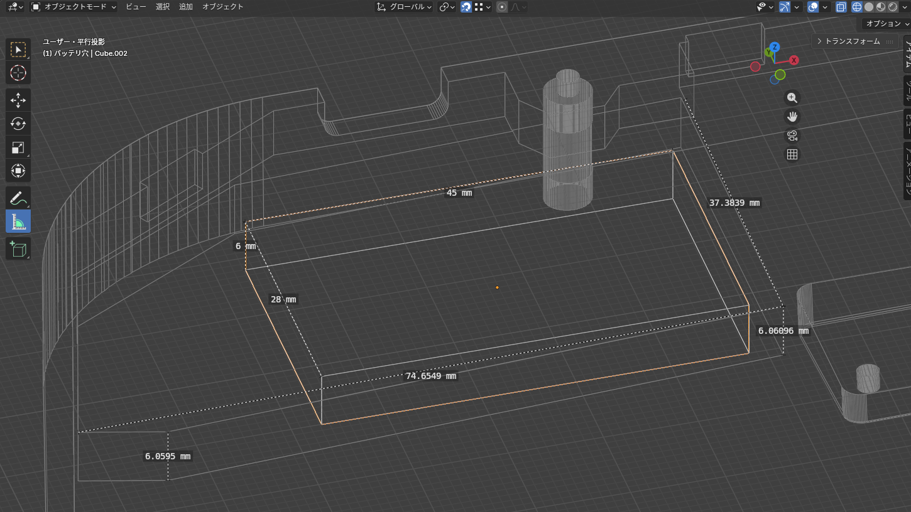

別角度  
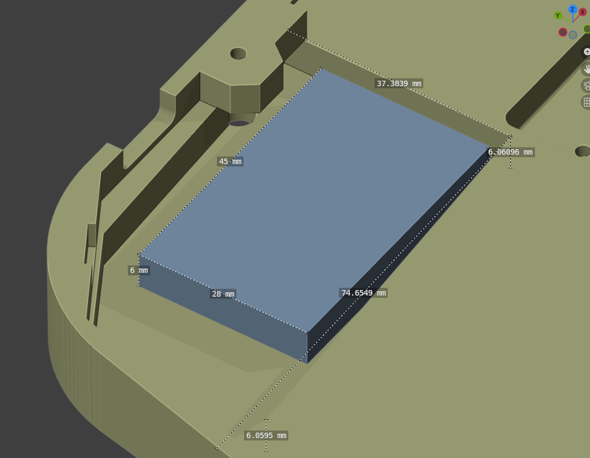

## はんだ付け
### マイコン(Xiao)はんだ付けの下準備
マイコンには購入したときにピンヘッダが付属されていると思います。  
これは位置合わせに使用します。  
**注意：ピンヘッダははんだ付けしないでください。**  

#### カプトンテープ  
まずXiaoの背面の一部をカプトンテープで絶縁します。  
テープでの絶縁が無しでも大丈夫な基板設計にしていますが、はんだ付けに自信がない方は(ある方も)ぜひ貼ってください。  
バッテリー短絡やリセットスイッチの短絡を防ぎましょう  
付属のテープを適当なサイズにはさみなどでカットして以下の画像のように貼ってください。  
画像では長方形を3枚貼りました。  
(青色のマスキングテープは後述しますので、今は無視してください。)  

#### マイコンの予備はんだ  
マイコンに予備はんだしておきます(BAT+と、NFC部分2か所)。  
少しだけ盛り上がるぐらいで構いません。  
あらかじめ少しだけはんだをつけておいてください。後々楽です。  
以下ようなイメージです。  
リセットスイッチ用の丸い箇所は予備はんだなしで良いです。予備はんだすると基板とマイコンに隙間ができやすいため。  
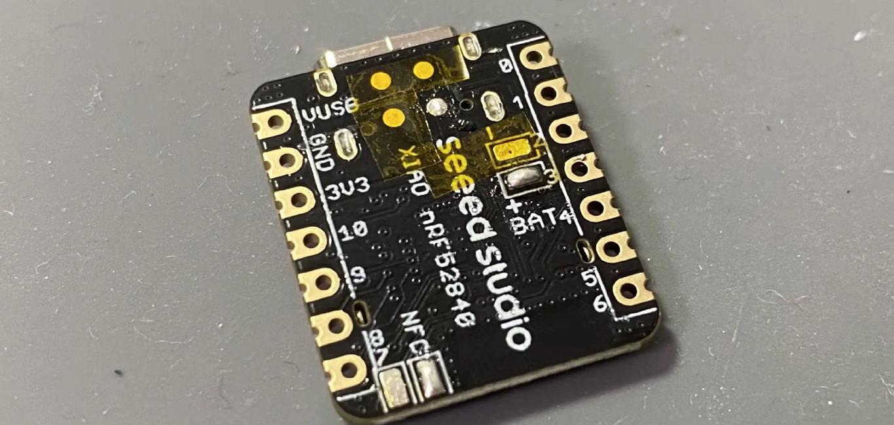

#### 基板の予備はんだ  
基板側の端面スルーホール4か所に予備はんだしておきます。  
少しだけつける程度で大丈夫です  
(※下の画像はMoooseMiniですが、要領は同じです。)
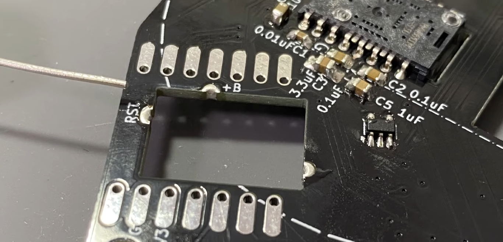

#### マイコンの位置合わせ  
基板の表面、光学センサのレンズがある側にXiaoをはめます。  
付属するピンヘッダを使って位置合わせをします。  
**位置合わせだけですのでピンヘッダははんだ付けしないでください！**  
ピンヘッダで位置を合わせたらマスキングテープなどで固定してください。  
(※下の画像はMoooseMiniですが、要領は同じです。)
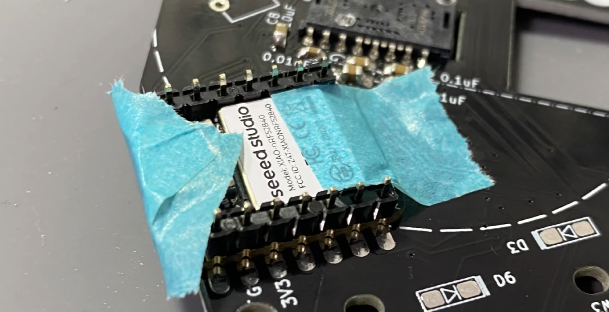

背面のパッド4か所をはんだ付けします。  
はんだ付けのコツは傾けて重力を活用し、パッドから端面スルーホールに滑らせるようにする点。  
繰り返しますがピンヘッダははんだ付け**しない**でください。  

RSTとBAT+

同じ要領でNFC2か所(マイコン下側の2か所)もはんだ付けしてください。  

最後に表面の端面スルーホールを基板のパッドとはんだ付けします。  
ピンヘッダは外してくださいね。  

### バッテリ端子
基板の裏側にバッテリ端子をはんだ付けします。  
バッテリ端子ですが、ペンチなどで足の部分を伸ばして穴に刺さるようにするとはんだ付けしやすいです。  

固定用パットの片側にはんだを盛ってください。  
側面の片側をはんだ付けします。  
このとき、位置・向きがずれないようにしてください。  

表側を向けて端子2か所をはんだ付けします。  
足を伸ばしていれば刺さっているはずです。  
(曲がったままでも表面実装のようにはんだ付けしてしまって構いません。)  
電源関係の部品なので、ショートしないよう注意してください。  

はんだ付けできたら反対側の固定用パットもはんだ付けしてください。  

バッテリー側のプラスマイナスも必ず確認してくださいね。  
はんだ付けしたものとプラスマイナス合わせてください。  

### ダイオード、MX互換キースイッチソケット  
ダイオードは表面実装タイプになっています。  
枠内の|◁の縦線とダイオードの縦線で方向を合わせてください。  
また、白枠の外側にも線を追加しています。  
この向きは自作キーボードで特定のキーが動かない原因になるあるあるなので向きに注意してください。  
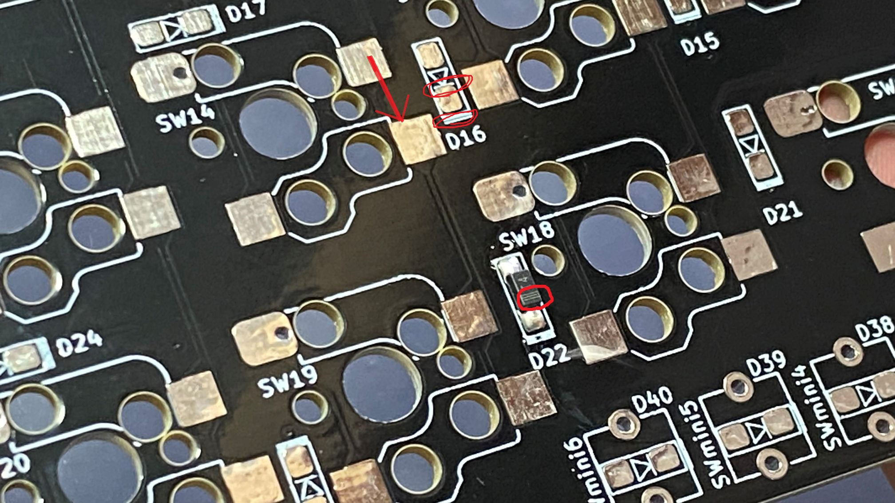

キースイッチソケットも上記の画像のようにはんだ付けしてください。  
※ロータリーエンコーダをつける場合、該当箇所にはソケットをはんだ付けしないでください。  
ロータリーエンコーダと干渉します。  

MX互換の場合  

ロープロファイルの場合  

### 4方向+プッシュスイッチ
表面実装部品ですので、方向を間違えないよう注意してください。  
基板の三角形マークとスイッチ部品の欠けの向きを合わせてください。  

まず一か所、基板側に予備はんだしておきます。  

ピンセットなどで位置・向きがずれないようはんだ付けしてください。  
一か所つけて固定できたら残りの箇所もはんだづけします。  

ｄ
### リセットスイッチ
マイコンリセットで使用するスイッチです。  
マイコンにファイルを書き込む際にはこのスイッチを短く2回連続で押してください。  
  
背面ははんだ付けしたら足をニッパーなどでカットしてください。  
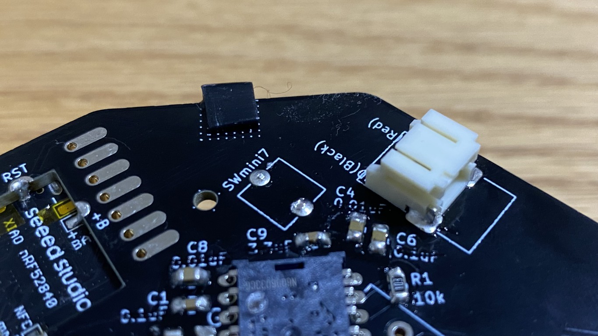  

### タクトスイッチ
手前に5個、奥に2個、カバーで隠れる部分に1個、片手で合計8個装着可能です。  
私はBluetooth接続切換えにも使用しています。  
要領はどれも同じなので写真は手前部分のみ。  
角度がずれるとミドルプレートがうまくはまらないので注意していください。  
はんだ付けしたら余分な足はニッパーでカットしてください。  
  
  

### ロータリーエンコーダ(任意)
足が合計5本あります。  
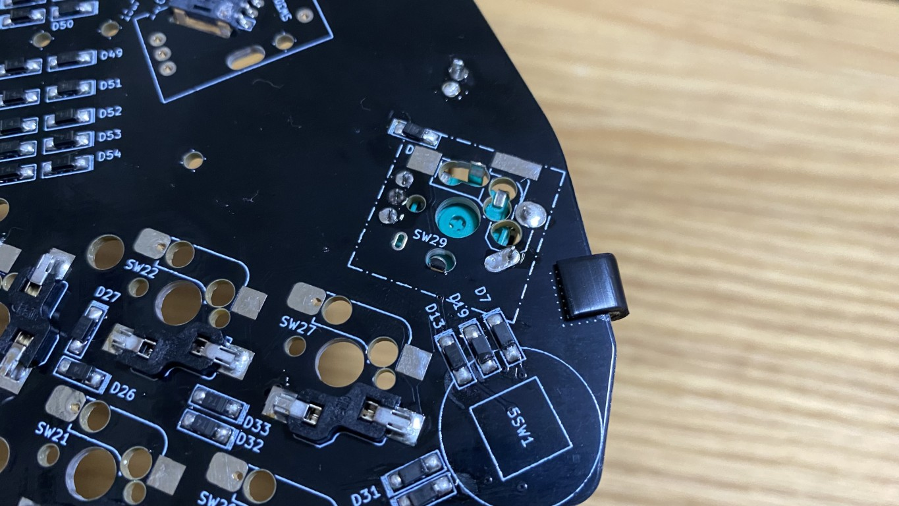
左手側はこの位置になります。  
トリッキーですが、エンコーダの足を伸ばすようにしてください。  
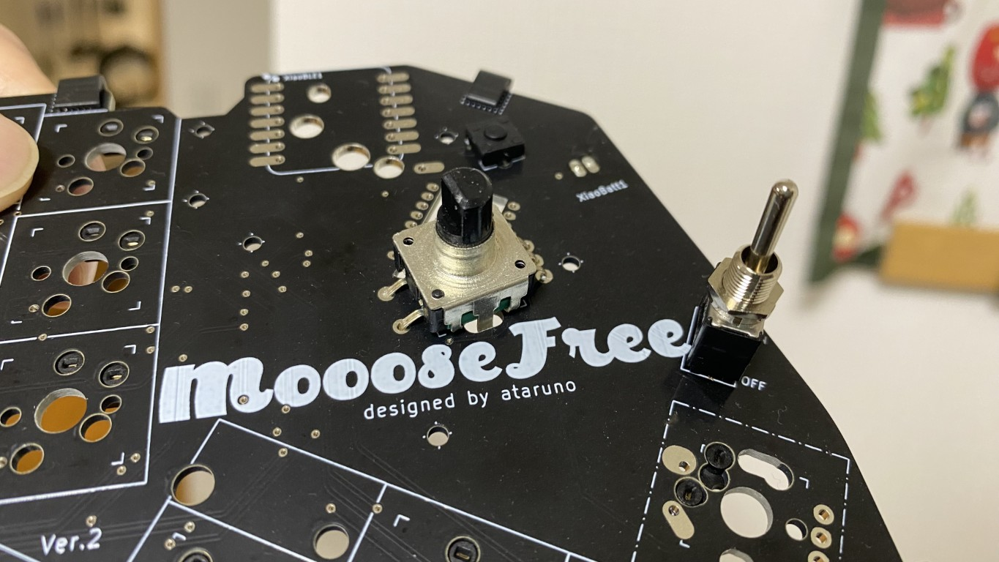
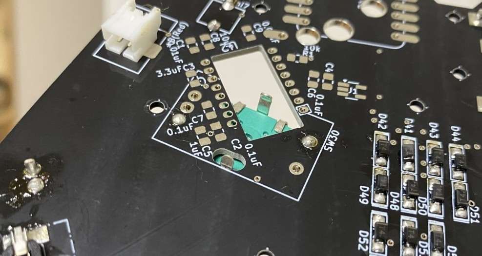
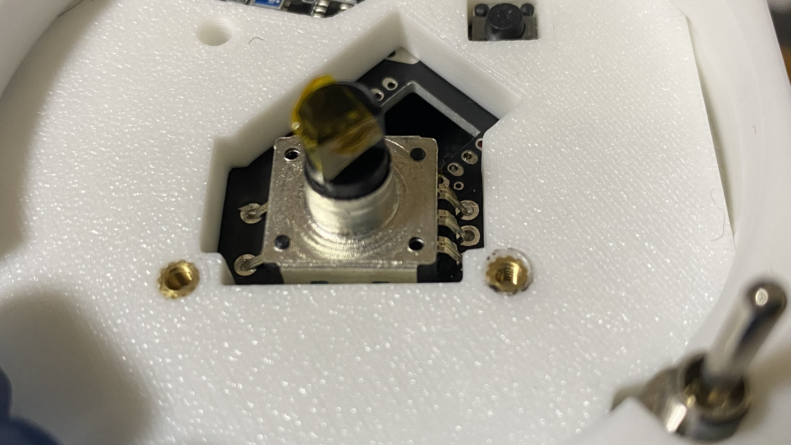

### 電源スイッチ
2か所穴が空いています。表面からトグルスイッチをはめてください。  
はまるようにしかはまらないので迷わないと思います。  
裏面からはんだ付けしてください。  

### はんだ付け後
こうなります。  
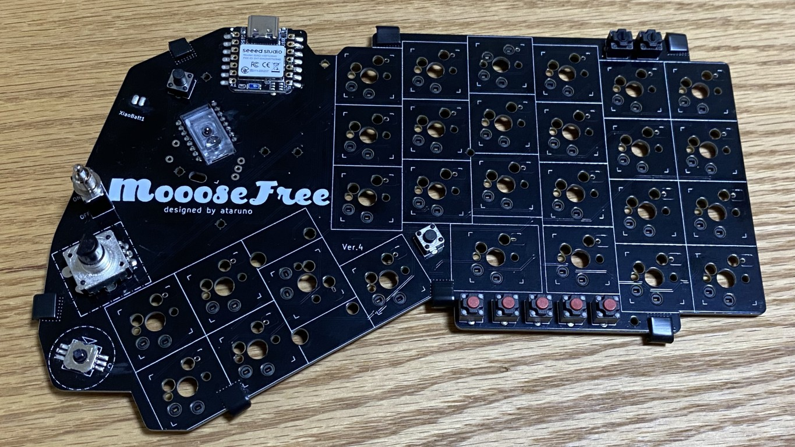  

