# MoooseFreeのソフト面について

## 書き込みファイルの置き場
以下にファイルを置きます。  
https://github.com/ataruno/MoooseFree/tree/main/firmware

25/12/10時点の最新はGithub Actions#45
https://github.com/ataruno/MoooseFree/tree/main/firmware/MoooseFree_firmware_45

各ファイルの解説です。  
* 右手に書き込むのは"MoooseFree_right-seeeduino_xiao_ble-zmk.uf2"
* 左手に書き込むのは"MoooseFree_left-seeeduino_xiao_ble-zmk.uf2"
* マイコンをいったん初期状態に戻すときは"settings_reset-seeeduino_xiao_ble-zmk.uf2"
* 上記3つのファイルが入っているのが.zipファイル(MoooseFree_firmware_#xx.zip)
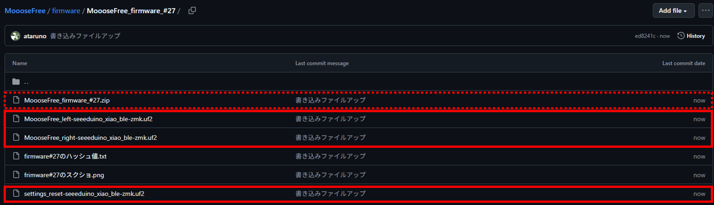

なぜZipファイルも上げているかは後述の[セキュリティの話](#セキュリティの話)を確認ください。  

## ソフト書き込み
接続方法についてyoutubeの動画をアップしています。合わせてご確認ください。  
https://www.youtube.com/watch?v=u2jcjx3hFhA
※動画内の工夫以外にもいろいろ工夫して接続が途切れる問題が起きないよう努めています。  

まず、USBに接続してください。  
次にマイコンリセットを2回押してください  
マイコンリセットスイッチは右手ですと、トラックボールをどかすと見えるタクトスイッチです。左手も同様の箇所にあります。  
指先で押しづらい場合は何か固い棒などを使ってください。  
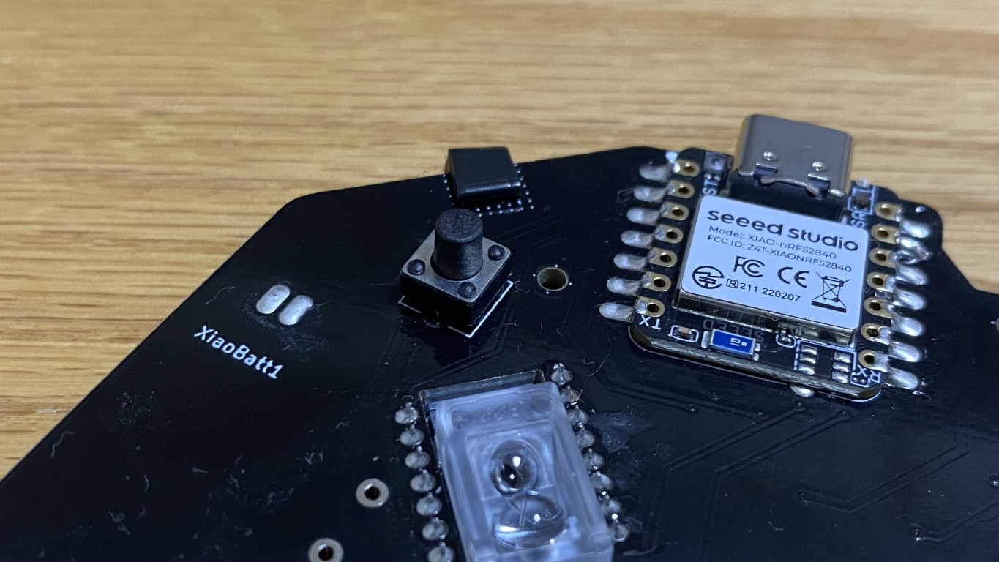  

すると以下のように"XIAO-SENSE(E:)"というようにフォルダが開きます。  
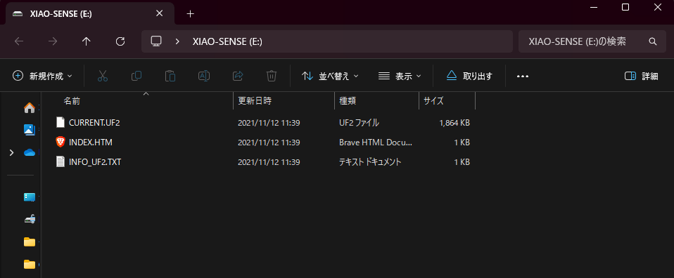

ここにMoooseFreeのソフトファイル(uf2)をドラッグ＆ドロップしてください。  
右手側には右手用のuf2ファイルを、左手側には左手用のuf2ファイルを書き込みます。  
このとき、バッテリーの電源はOFFにした状態で書き込みを行ってください。  
また、他のzmkファームウェアを使用したキーボードの電源もOFF状態でお願いします。  
変にペアリングをしないようにするためです。  
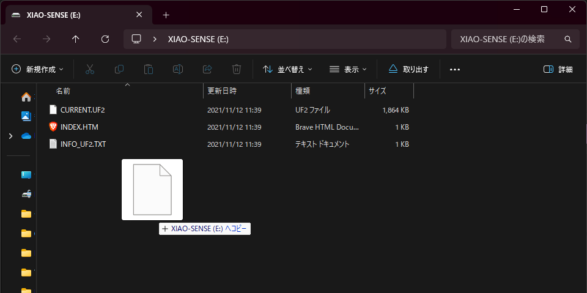  

```
まれに以下のようなポップアップが出るようです。  
これは自動でデバイス接続が外れるために生じるそうですが、書き込みはできているようです。スキップしてください。  
よっぽど大丈夫だと思いますが、もし、うまく書き込めていなさそうな場合はMoooseFreeのuf2を上記のソフト書き込み手順に従いもう一度書き込みをしてみてください。  
もしくは、一度Xiaoのリセットuf2ファイルを書き込み、その後、再度MoooseFreeのuf2を書き込んでみてください。  
```
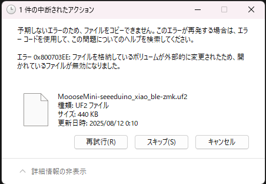

書き込みされると勝手にフォルダが閉じます。(動画だと6分10秒くらいから)  

ここから以下はuf2ファイルがマイコンに書き込まれた前提でのビルドガイドになります。  

## インジケータについて
電源を入れたら、2回マイコンのLEDが光ります。
1回目がバッテリーの充電状態を示しており、2回目がBluetooth接続状態を示しています。

### バッテリーの充電状態
青：十分充電あり  
黄：充電少なくなってきているよ  
赤：充電かなり少ない  

USB接続した状態で電源スイッチをONするとバッテリーに充電されます。  

**注意：バッテリーへの過度な充電を防ぐため、バッテリー充電状態で放置しないでください。**  

**自身が使用して目が届いている範囲内でバッテリー充電をしてください。**  

### Bluetooth接続状態
青：接続状態  
黄：ペアリング待ち状態  
赤：未接続状態  

PCとのBluetooth接続の仕方は後述の[Bluetooth接続の仕方](#bluetooth接続の仕方)を確認ください。  

## キーマップ
キーマップ変更方法は2種類あります。  
主にZMK Studioを使用する場合をメインに説明します。
Webブラウザ上で完結するためキーマップを簡単に編集可能です。  

ロータリーエンコーダの動作についてはZMK studioでは現時点で指定できないようです。  
また、レイヤーは5層になっています。  

### デフォルト設定や固定のもの
キーマップ変更に入る前に、デフォルトの簡単な解説やZMK studioでは変えられない固定箇所の説明です。  

#### デフォルト設定
最も使用するデフォルトレイヤー(レイヤー0)で説明します。  
ZMK studioでの設定を横に乗せています。  


レイヤーの構成は以下のイメージで作ってみました。
* レイヤー0 ... デフォルトのマウス操作
* レイヤー1 ... 矢印キーレイヤーキー ※1
* レイヤー2 ... 左手：ウインドウ位置変更、右手：数字キー レイヤー
* レイヤー3 ... F15～F24(AutoHotKey)レイヤー ※2
* レイヤー4 ... ファンクションキーなど

※1：オリジナルキーが右手の一部に設定されています。  
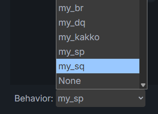
* my_sq ... シャープ#が入力されます。
* my_dq ... ダブルクォーテーション2つ""が入力されます。
* my_sq ... シングルクォーテーション2つ''が入力されます。
* my_kakko ... 括弧()が入力されます。

#### 固定のもの(=ZMK studioでは変更不可のもの)
ロータリーエンコーダの回転  
* レイヤー0,1,2 ... スクロールダウン/スクロールアップ  
* レイヤー3,4 ... 音量アップ/ダウン  

トラックボール操作の挙動  
レイヤーキーを押しながら操作するとカーソル操作とかできます。  
* レイヤー0 ... 通常操作
* レイヤー1,2 ... 細かな操作モード
* レイヤー3,4 ... スクロール操作モード

#### デフォルトレイヤーの説明
デフォルトレイヤーは以下のようになっています。ご参考まで  
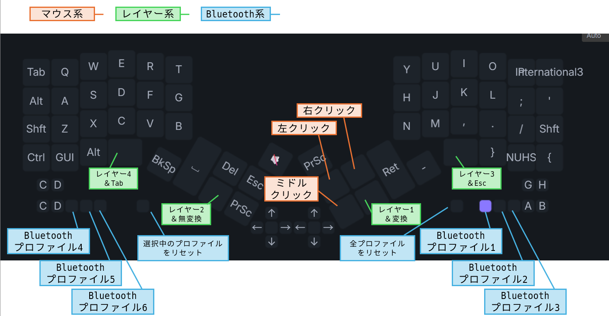


### (1) ZMK Studioを使用する更新方法  
USB接続した上で https://zmk.studio にアクセスしてください。  
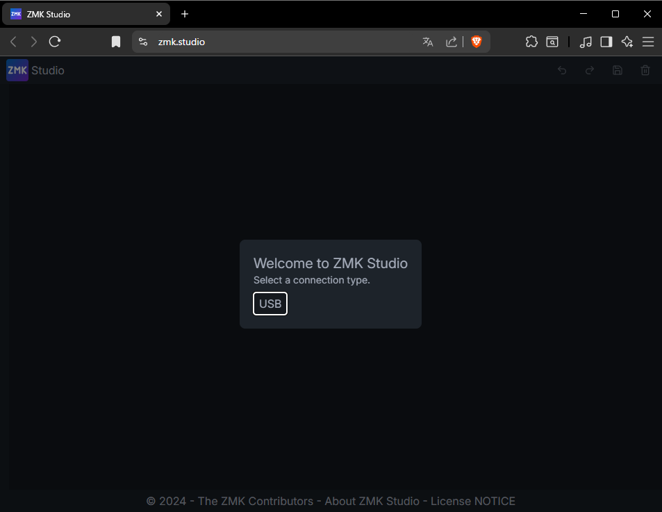

「USB」をクリックするとポップアップが表示されます。  
MoooseFreeを選択し、"接続"をクリックしてください。  
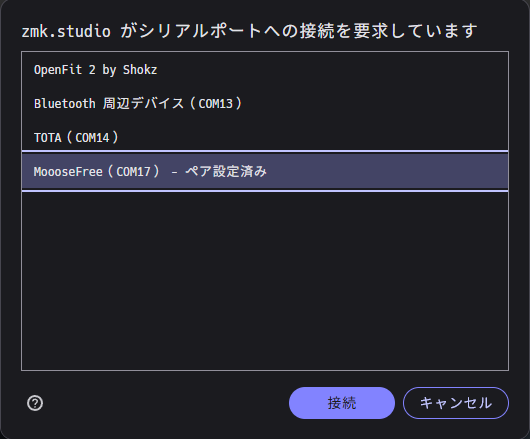

設定画面が表示されます。レイヤーは0～4の5つです。  
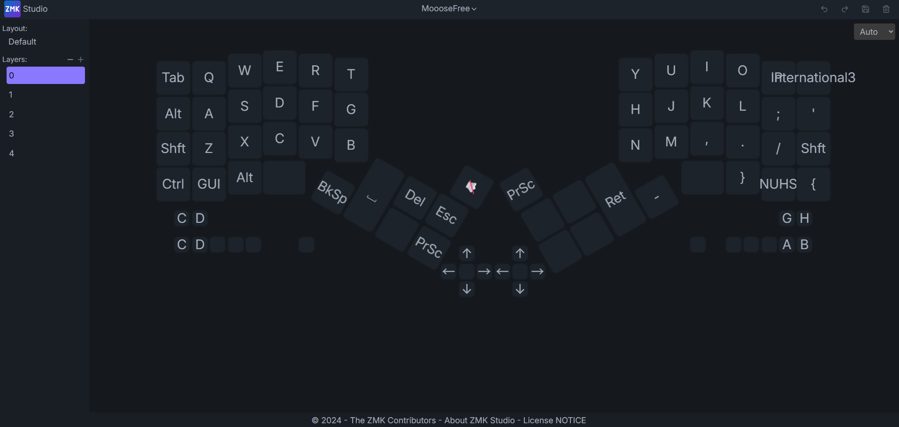

何も設定されていない空白のように見えますが、クリックしてみると実は設定されていることがわかります。  
下の画像では"Mouse Key Press"の"MB1"、つまり左クリックが設定されています。  
このBehaviorについては[ZMKのドキュメント(Behaviors)](https://zmk.dev/docs/keymaps/behaviors)をご確認ください。  
例えば文字入力の設定をしたい場合は[KeyBoardのページ](https://zmk.dev/docs/keymaps/list-of-keycodes#keyboard)です。  
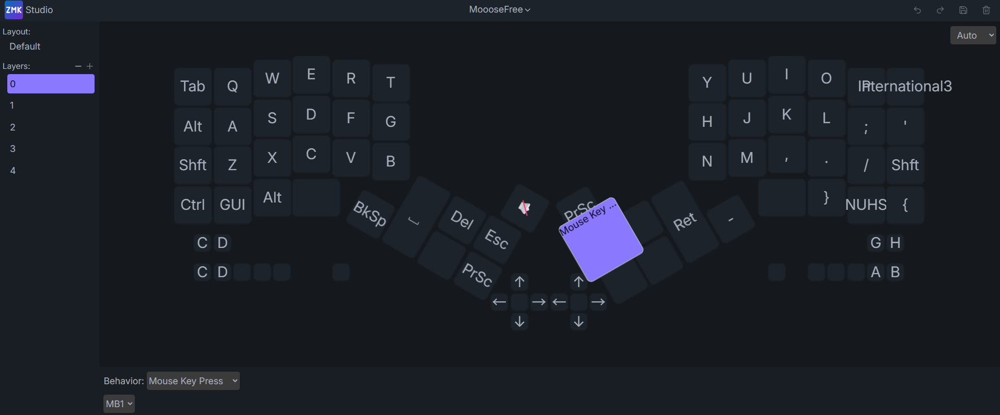

「Behaviorでカテゴリを選択し、そのカテゴリ内の設定値を指定する」だと伝わりやすいでしょうか。  
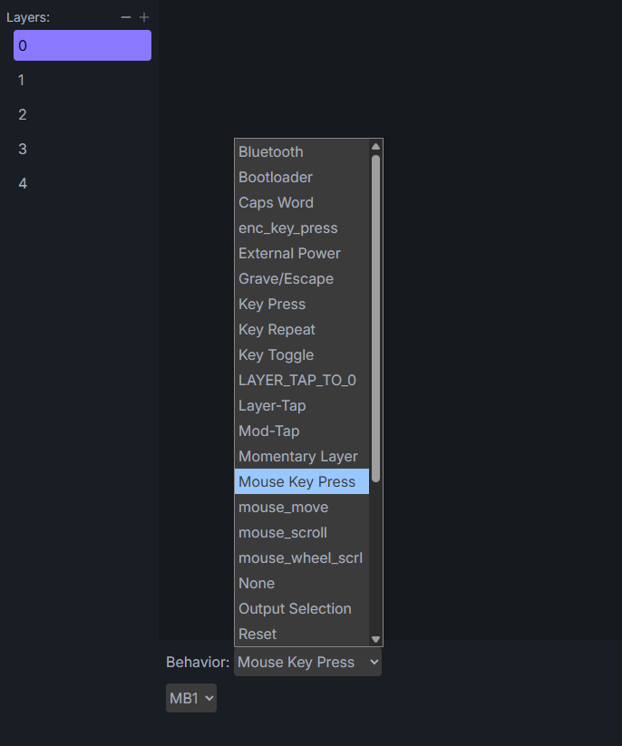

"Mouse Key Press"だと他に右クリック(MB2)やミドルクリック(MB3)など選択可能です。  
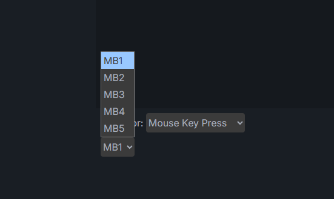

"押している間レイヤーを切換える設定"もあります。  
Behaviorの"LAYER_TAP_TO_0"ですと、長押し時に指定したLayer、短押し時に指定したKeyが設定できます。  
下の画像ですと、長押し時にLayer3になり、短押し時に"Esc"が入力されます。  
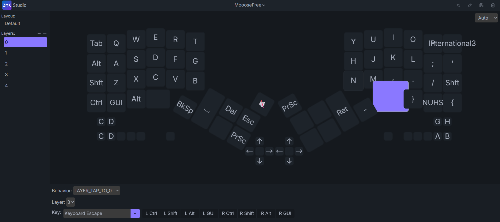

### (2) ZMK Firmwareを使用する更新方法
[MoooseFreeのZMK FirmwareのGithubリポジトリ](https://github.com/ataruno/zmk-MoooseFree)をForkしてください。  
Github上でキーマップを編集しコミットすると、Github Action上でビルドされ書き込みファイルが生成されます。  

## Bluetooth接続の仕方
デフォルトではデフォルトレイヤーの手前のタクトスイッチにプロファイルキーを用意しています。  


初めてソフトを書き込んだ時点では、どのBluetoothプロファイルも設定されていない状態です。  
プロファイル1でPCに接続したい場合。  
MoooseFreeのプロファイル1を選択(=タクトスイッチを押す)。  
Xiaoマイコンのインジケータが黄色(接続設定待ち状態=ペアリング待ち状態)になるはずです。  
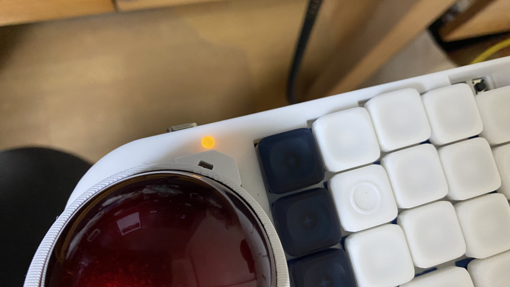

次にPCのデバイスの追加からBluetooth接続機器を探し、MoooseFreeを接続してください。
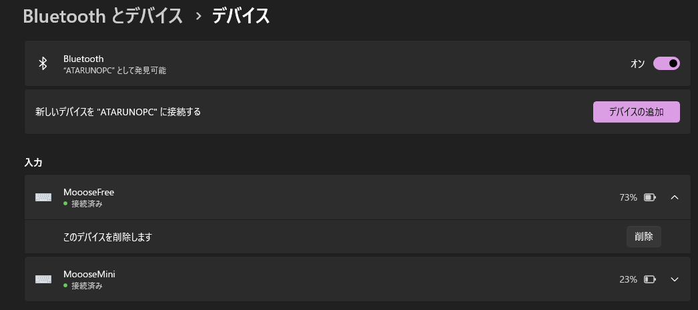

MoooseFreeのインジケータが青色になれば無線接続状態です。  
また、ペアリングした機器の電源が入っていない場合など接続していない場合は赤色が表示されます。  
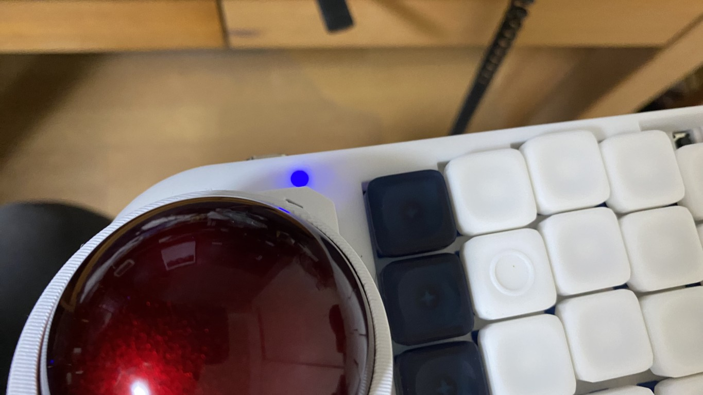


## セキュリティの話
気にされている人がどこまでいるかわかりませんが、ちょっとセキュリティの話。  
気にならない人は読み飛ばしてOKです。

### Github Actionsで生成されたファイルか否かの確認(トレーサビリティ)
ZMK frimewareではGithub Actionsで書き込みファイルを生成できる仕組みが構築されています。  
ソースコードを編集しGithubのリポジトリを更新するとGithub Actionsが走り、最後にはzipがダウンロードできる状態になります。  
さて、頒布用にアップロードしたzipファイルが本当にGithub Actionsで生成されたファイルかどうか確認したいですね。  
もしかすると(そんなことはないはずだが)、悪意をもった誰かが書き込みファイルを改ざんしているかもしれない…。

## ハッシュ値の話
Github Actionsでファイルが生成されるとzipがダウンロードできる状態になります。  
このとき、このzipファイルに対してハッシュ値計算した値がGithub Actions画面上には表示されます。  
"firmware27のスクショ.png"の右下にある文字列です。  
sha256:59e0812805a39faae4c6a50fdb77c42abe087ae8977394aa329e928cfdb706a3
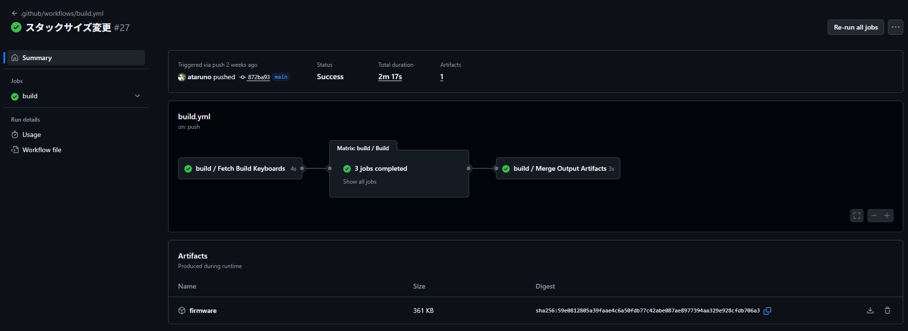

ハッシュ値は元データに対して一意になるような計算がされます。  
また、ハッシュ値計算のアルゴリズムはオープンなものですので、自分で計算することも可能です。  
つまり、ユーザー自身がZipファイルのハッシュ値計算をして、Github Actionsで表示されているハッシュ値計算と合致すれば、両者はまったく同じファイルと言えるわけです。

Windowsは標準機能でハッシュ値計算ができるそうな。  
コマンドは以下。  
certutil -hashfile ＜ファイルパス＞ [ハッシュアルゴリズム]  
ということでやってみました。  
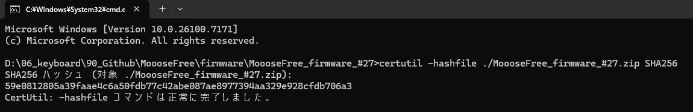

確かに同じ値になっていますね！  
これで安心して「あっ、このファイルはGithub Actionsで生成されたままの状態だな」とわかるわけです。  


